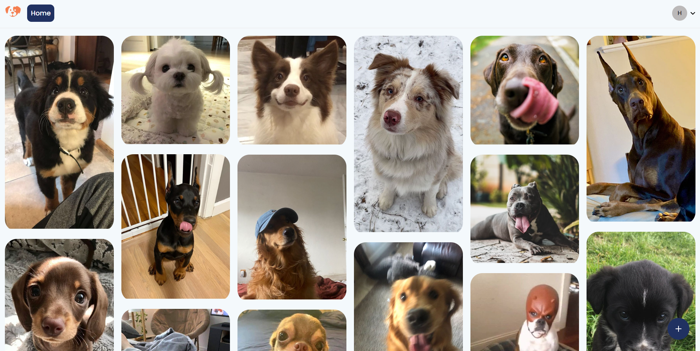

<h2>About the project</h2>

Pet Lover Hub is a pet lover app focused on building a community of pet owners. It was developed using React and Firebase for authentication, as well as Firebase Storage for uploading and retrieving files.

👉 Live Demo: <a href='https://pettrainerhub.vercel.app' target="_blank" >Pet Lover Hub Demo</a>

<h3>Built using:</h3>

» React JS  
» CSS  
» HTML 

 

<h2>Project Screenshots</h2>
 
<h3 align='center'>Landing Page 🌎</h3>

  

  

<h3 align='center'>Log In Page 🔒</h3>

  

  
<h3 align='center'>Sign Up Page 🛎️</h3>

  

  
<h3 align='center'>Reset Page 🦾</h3>

  

  
<h3 align='center'>Home Page 🏡</h3>

  

  
